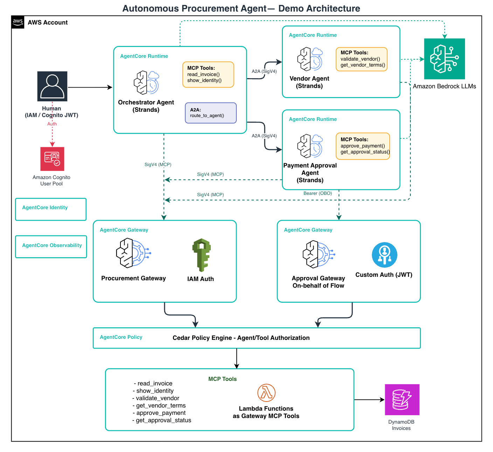

# Zero Trust Agentic AI with Amazon Bedrock AgentCore

> **AWS Summit New York 2026 — Session SEC304**
> *Zero Trust for AI Agents: Implementing Identity Chains with Amazon Bedrock AgentCore*

> **⚠️ Important:** This project is sample/demo code for educational purposes only. It is not intended for production use. See the [Security](#security) section for production hardening guidance.

A hands-on demo showing how to apply Zero Trust principles to autonomous AI agents using [Amazon Bedrock AgentCore](https://aws.amazon.com/bedrock/agentcore/).

## The Scenario

An autonomous procurement agent processes vendor invoices and approves payments. Without Zero Trust controls, a prompt injection in an invoice can trigger a fraudulent payment. This demo shows how to contain the blast radius at every layer of the agent stack.

## What You'll Build

Three Strands-based AI agents — **Orchestrator**, **Vendor**, **Approval** — connected through an AgentCore MCP Gateway enforced by Cedar policies.



**Two gateways, two auth modes:**
- **ProcurementGateway** (`AWS_IAM`, Phases 1–4): agents authenticate via SigV4. Cedar sees IAM role ARN as principal — scopes each agent to its own tools.
- **Phase5ApprovalGateway** (`CUSTOM_JWT`, Phase 5): human's Cognito ID token carried as Bearer through every agent hop. Cedar sees the human's `role` claim (`admin` / `operator`) at the tool layer.

**Two identities per agent:**
([Agent Identities](agent_identities.png))
- **IAM Execution Role** — answers "what AWS resources can this agent use?" (DynamoDB, Bedrock, CloudWatch). Long-lived STS credentials, rotated automatically.
- **Workload Identity** — answers "who is this agent when talking to other services?" Short-lived JWT (~15 min), minted per invocation, used for Cedar gateway authorization and A2A trust.

## The 5 Phases

| Phase | ZT Pillar | Control |
|---|---|---|
| [**Phase 1**](phase1.png) | Verify Explicitly | Runtime resource policy — deny-by-default on who can invoke the agent |
| [**Phase 2**](phase2.png) | Least Privilege | Scoped execution role — GetItem on one table, nothing else |
| [**Phase 3**](phase3.png) | Enforce at Point-of-Action | Cedar ENFORCE at the gateway — $750 invoice blocked before Lambda cold-starts |
| [**Phase 4**](phase4.png) | Assume Breach | A2A resource policies — only OrchestratorAgent can call VendorAgent/ApprovalAgent |
| [**Phase 5**](phase5.png) | Verify Explicitly (end-to-end) | On-behalf-of token — human's Cognito role visible at every agent hop |

## Quick Start

```bash
# Prerequisites: Python 3.11+, Node.js 18+, AWS CLI v2, CDK CLI 2.100+
# Requires AdministratorAccess + Bedrock claude-sonnet-4-6 model enabled in us-east-1

export AWS_PROFILE=zt-demo-deployer
python3 -m venv .venv && source .venv/bin/activate
make install
make bootstrap      # once per account/region
make demo-setup     # deploys everything (~15–20 min first time)
make smoke          # verify 9 checks pass
```

See [SETUP.md](./SETUP.md) for full prerequisites and per-session checklist.

## Running Phases

```bash
make phase1                                      # Verify Explicitly: runtime resource policy
make phase2                                      # Least Privilege: scoped execution role
make phase3                                      # Enforce at Point-of-Action: Cedar gateway (LOG_ONLY)
python scripts/toggle_policy_mode.py ENFORCE     # switch Cedar to binding ENFORCE mode
make phase4                                      # Assume Breach: A2A trust + prompt injection
make phase5                                      # Verify Explicitly (full chain): OBO identity
make ui                                          # Streamlit dashboard (localhost:8501)
```

## Tech Stack

- **Agents**: [Strands Agents SDK](https://strandsagents.com) + Bedrock AgentCore Runtime
- **Gateway**: AgentCore MCP Gateway with [Cedar](https://cedarpolicy.com) policy engine
- **IaC**: AWS CDK (Python)
- **Model**: `us.anthropic.claude-sonnet-4-6` (cross-region inference, us-east-1)
- **Auth**: SigV4, Cognito JWT, Cedar policies, workload identity tokens

## Repository Structure

```
agents/          # OrchestratorAgent, VendorAgent, ApprovalAgent
infra/           # CDK stacks (Foundation, Orchestrator, Vendor, Approval)
policies/        # Cedar policy files (permit + forbid rules)
scripts/         # Setup and invocation scripts
tests/           # Unit tests (run offline, no AWS needed)
streamlit_app.py # Interactive dashboard UI
```

## Security

This demo **intentionally** deploys overly permissive IAM policies to illustrate Zero Trust hardening during the live walkthrough (especially Phase 2). **Do not use these configurations in production.** Before adapting this code for real workloads:

- **Remove `AmazonDynamoDBFullAccess`** from the orchestrator execution role — use scoped `dynamodb:GetItem` on specific table ARNs only
- **Replace `bedrock-agentcore:*`** on the gateway service role with the minimum required actions (`bedrock-agentcore:InvokeGateway`, etc.)
- **Remove `AccountRootPrincipal()`** from IAM trust policies — restrict to specific principal ARNs that need to assume the role
- **Enable MFA** on the Cognito User Pool for any human-facing authentication
- **Change the default demo password** (`DemoPass1!`) — use AWS Secrets Manager or enforce strong password rotation
- **Scope Cedar policies** to specific resource ARNs rather than wildcards where possible
- **Enable AWS CloudTrail and GuardDuty** for comprehensive audit logging and threat detection
- **Rotate Cognito tokens** — the demo uses short-lived tokens (1 hour) but production systems should implement proper refresh token flows

If you discover a potential security issue in this project, please notify AWS/Amazon Security via the [vulnerability reporting page](http://aws.amazon.com/security/vulnerability-reporting/). Please do **not** create a public GitHub issue for security vulnerabilities.

## Additional Resources

- [NIST - Zero Trust Architecture](https://csrc.nist.gov/pubs/sp/800/207/final)
- [Zero Trust on AWS](https://aws.amazon.com/security/zero-trust/)
- [Agent toolkit for AWS](https://aws.amazon.com/products/developer-tools/agent-toolkit-for-aws/)
- [AgentCore Samples](https://github.com/awslabs/agentcore-samples)

